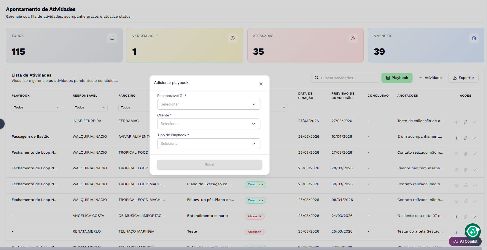

# Implementação do novo formulário de playbooks

## Contexto

Hoje, dentro da plataforma onde @components/index.html está rodando no Mitra, temos a possibilidade de conectar formulários nativos da plataforma, que ficam conectados automaticamente aos cadastros do banco. Segue abaixo um exemplo de como ele está operando.



Entretanto, hoje ele tem 2 problemas que impactam diretamente a experiência do usuário e dos desenvolvedores:

1. Por ser nativo, ele não tem customização avançada, tende a ser muito engessado, e não conseguimos implementar nosso design system nele. Além disso, os campos do form nativo não permitem personalização de dados, pré-carregamento de informações, ou qualquer tipo de customização que facilite a experiência do usuário.
2. Sua performance, com base no que trouxe acima, não é das melhores, e tende a travar em campos com muitos dados. Um formulário personalizado permite criar uma query otimizada para a seleção dos dados desejados e novas features aprimoradas.

## Objetivo

O objetivo deste projeto é criar um novo formulário de playbooks que seja totalmente customizável, que utilize o design system da plataforma, e que tenha uma performance melhor. Além disso, queremos que ele seja mais fácil de usar e que ofereça uma melhor experiência para o usuário.

## Requisitos

O formulário deve:
- Ser totalmente customizável
- Ser em formato de modal
- Utilizar o design system da plataforma
- Ser simples de usar
- Oferecer uma melhor experiência para o usuário

Como base de referência e inspiração, você pode utilizar o formulário de reportar bug dentro de @components/index.html.

## Campos do formulário

- Responsável
- Parceiro
- Tipo do Playbook

## Dados para alimentar os campos do formulário

- Responsável:
```sql
SELECT DISTINCT
    PAR.ID_CONSULTOR_CS,
    USU.DESCR AS NOME_CONSULTOR
FROM
    CC_1325 AS HIST_CLI
INNER JOIN (
    SELECT
        ID_PARCEIRO,
        MAX(ID_CALENDARIO) AS MAX_ID_CALENDARIO
    FROM
        CC_1325
    WHERE
        ID_STATUS_CLIENTE <> 6
    GROUP BY
        ID_PARCEIRO
) AS LATEST_HIST
  ON HIST_CLI.ID_PARCEIRO = LATEST_HIST.ID_PARCEIRO
 AND HIST_CLI.ID_CALENDARIO = LATEST_HIST.MAX_ID_CALENDARIO
LEFT JOIN
    CAD_PARCEIRO AS PAR ON PAR.ID = HIST_CLI.ID_PARCEIRO
LEFT JOIN
    CAD_USUARIO AS USU ON USU.ID = PAR.ID_CONSULTOR_CS
WHERE
    PAR.ID_CONSULTOR_CS IS NOT NULL
    AND PAR.ID_CONSULTOR_CS <> -999
    AND TRIM(USU.DESCR) NOT LIKE '%Z';
```

- Parceiro:
```sql
WITH LATEST_HIST AS (
    SELECT
      ID_PARCEIRO,
      MAX(ID_CALENDARIO) AS MAX_ID_CALENDARIO
  FROM
      CC_1325
  WHERE
      ID_STATUS_CLIENTE <> 6
  GROUP BY
      ID_PARCEIRO
)

SELECT
    HIST_CLI.ID_PARCEIRO,
    PAR.DESCR
FROM
    CC_1325 AS HIST_CLI
INNER JOIN LATEST_HIST ON HIST_CLI.ID_PARCEIRO = LATEST_HIST.ID_PARCEIRO
 AND HIST_CLI.ID_CALENDARIO = LATEST_HIST.MAX_ID_CALENDARIO
LEFT JOIN
    CAD_1006 AS PAR ON PAR.ID = HIST_CLI.ID_PARCEIRO
WHERE
    HIST_CLI.ID_STATUS_CLIENTE <> 6
GROUP BY
    HIST_CLI.ID_PARCEIRO,
    PAR.DESCR;
```

- Tipo do Playbook:
```sql
SELECT * FROM CAD_11040 WHERE ID <> -999;
```

Todas essas queries devem ser implantadas dentro do @components/index.html e tanto Responsável quanto Parceiro devem ser reaproveitáveis para outros formulários futuros.

## Ações

- Botão Salvar
- Botão Cancelar

## Validações

- Todos os campos são obrigatórios
- O campo Responsável deve ser preenchido com um usuário válido
- O campo Parceiro deve ser preenchido com um parceiro válido
- O campo Tipo do Playbook deve ser preenchido com um tipo de playbook válido

## Regras de negócio

- O formulário deve ser aberto em um modal
- O modal deve ser fechado automaticamente após o salvamento dos dados
- O modal deve ser fechado automaticamente após o cancelamento dos dados
- O modal deve ser fechado automaticamente após o erro no salvamento dos dados

## Observações

O formulário deve:
- Ser responsivo
- Ser acessível
- Ser testado em diferentes navegadores
- Ser testado em diferentes dispositivos
 
- Ao preencher os campos, eles devem alimentar 3 variáveis do Mitra:
    - :VAR_GSC_PB_RESPONSAVEL
    - :VAR_GSC_PB_PARCEIRO
    - :VAR_GSC_PB_TIPO_DE_PLAYBOOK
